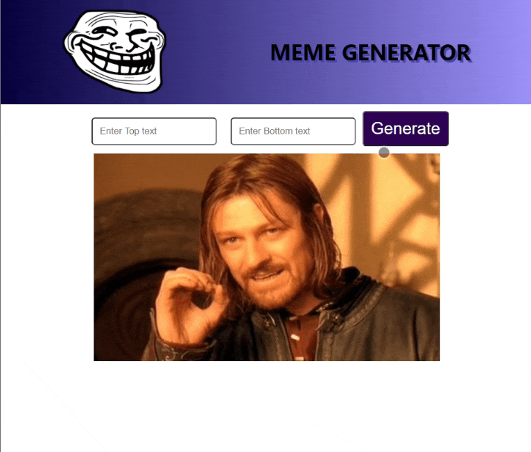

# **Meme Generator**
Generate memes anytime, anywhere.

***

## **Output**

***

## **How To Run**
## Getting Started with Create React App

This project was bootstrapped with [Create React App](https://github.com/facebook/create-react-app).

## Available Scripts

In the project directory, you can run:

### `npm start`

Runs the app in the development mode.\
Open [http://localhost:3000](http://localhost:3000) to view it in the browser.

The page will reload if you make edits.\
You will also see any lint errors in the console.

***

## **Built Using**
- HTML5, CSS3, JavaScript
- **Technologies:** 
  * Git
  * VS Code
- **Frameworks:**
  * ReactJS
***

## **Reach Me**

***